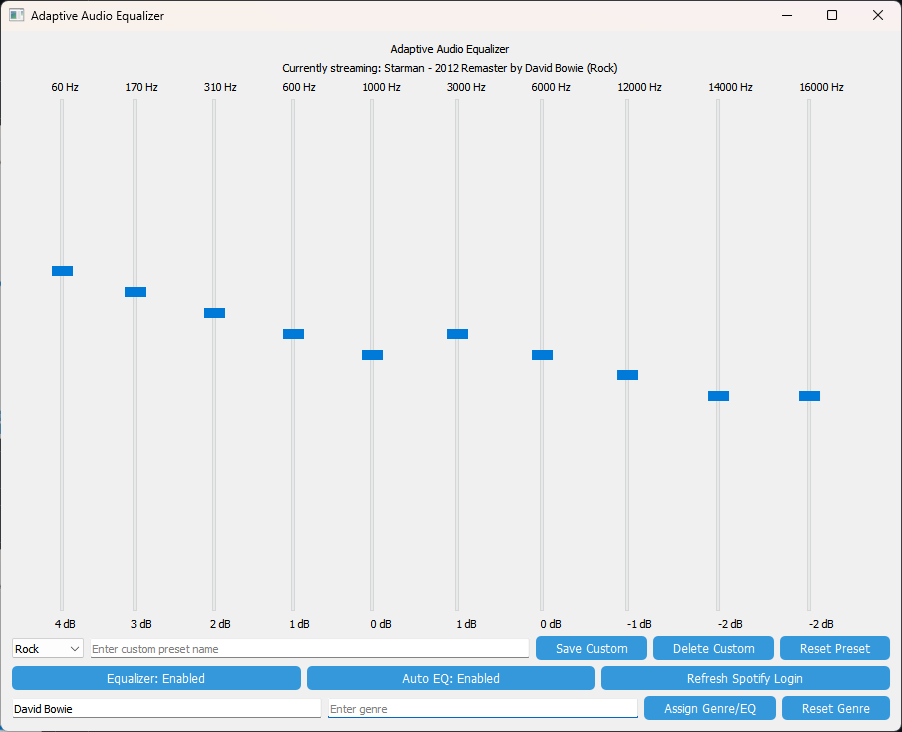
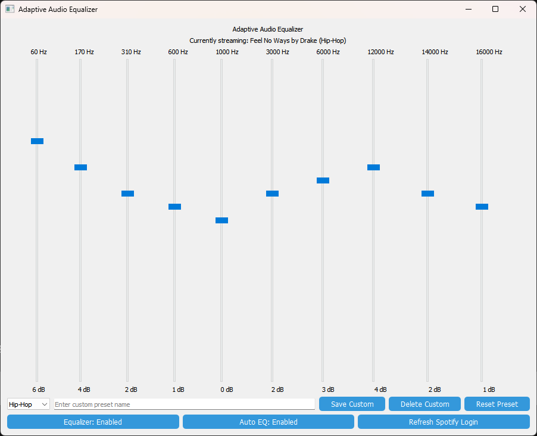
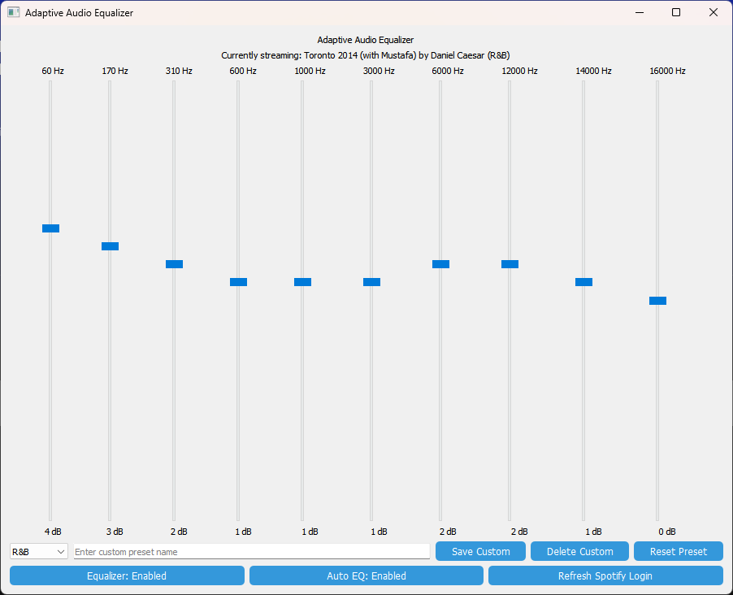
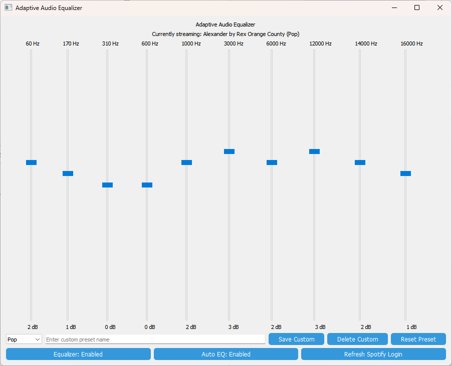
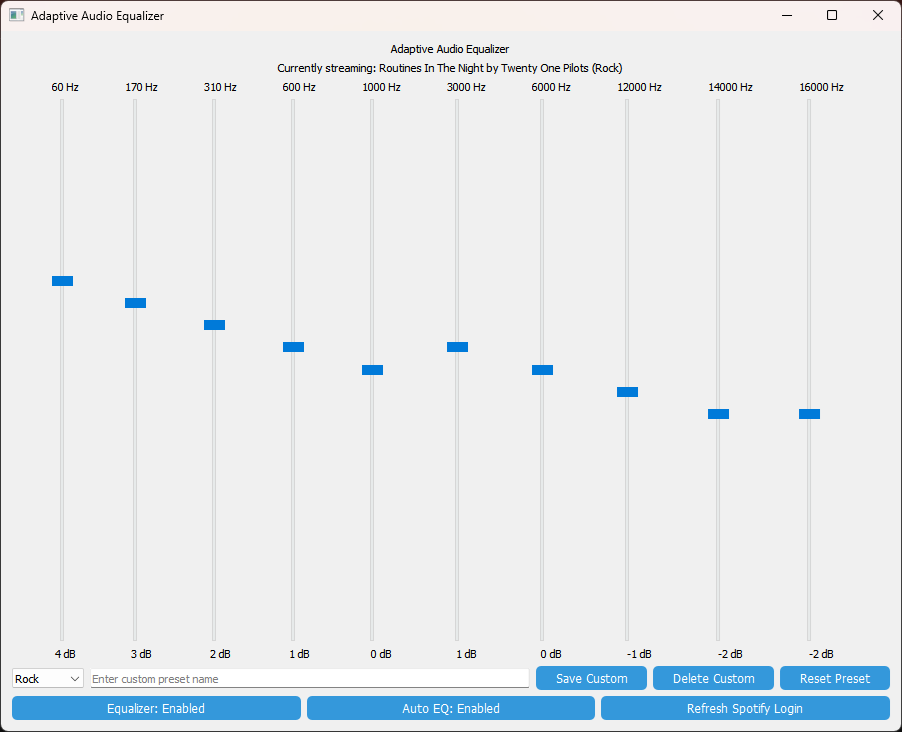

# AutoEQ

AutoEQ is an innovative application designed to enhance the listening experience across all audio sources on your computer. It provides a customizable 10-band graphic equalizer, includes genre-specific presets, integrates with Spotify to display the currently playing track, and enables automatic genre-based equalizer adjustments.

Full Application:



Here are some images showing the different genres available in the AutoEQ:

| Hip-Hop | R&B |
|---------|-----|
|  |  |
| Hip-Hop | R&B |

| Pop | Rock |
|-----|------|
|  |  |
| Pop | Rock |
---

## Features

### Equalizer Features
- **10-Band Equalizer**: Adjust frequencies ranging from 60 Hz to 16,000 Hz.
- **Custom Presets**: Create, save, and load personalized EQ settings.
- **Built-in Genre Presets**: Includes presets for genres like Pop, Rock, Classical, and more.
- **Real-Time Adjustment**: Applies equalizer settings to system-wide audio with low latency.
- **Flat Mode**: Reset all bands to 0 dB using the "Flat" preset.

### Genre Detection and Integration - Spotify
- **"Now Playing" Display**: Displays the currently playing track in real time.
- **Automatic Updates**: Updates every second to show the latest song from your Spotify account.
- **Genre Detection**: Detects the genre of the currently playing track and automatically adjusts the EQ based on pre-trained machine learning models.
- **Genre Assignment**: Assign specific genres to artists, allowing for management of "Unknown" genres and correction of mislabeled ones.

---

## Installation

### Prerequisites
- Python 3.8 or higher
- Required Python packages:
  - PyQt5
  - pyaudio
  - scipy
  - spotipy
  - python-dotenv
  - scikit-learn

### Hardware Requirement
- **Virtual Audio Cable**:
  - Required to route audio for processing by the application.
  - Install and configure a virtual audio cable of your choice (e.g., VB-CABLE).

### Steps

1. **Clone the repository**:
   ```bash
   git clone https://github.com/yourusername/adaptive-audio-equalizer.git
   cd adaptive-audio-equalizer
   ```

2. **Install dependencies**:
   ```bash
   pip install -r requirements.txt
   ```

3. **Configure Spotify API**:
   - Create a Spotify app at [Spotify Developer Dashboard](https://developer.spotify.com/dashboard/applications).
   - Note the **Client ID**, **Client Secret**, and **Redirect URI**.
   - Create a `.env` file in the `main/` directory with the following content:
     ```env
     SPOTIFY_CLIENT_ID=your_client_id
     SPOTIFY_CLIENT_SECRET=your_client_secret
     SPOTIFY_REDIRECT_URI=http://localhost:8888/callback
     ```

4. **Set up virtual audio devices**:
   - Run the application to list available audio devices.
   - Note the input and output device indices from the terminal output.
   - Update `input_device_index` and `output_device_index` in `start_stream()` in `equalizer.py`.

5. **Run the application**:
   ```bash
   python main.py
   ```

---

## File Structure

```
autoeq/
│
├── archive/                     # Archived/old files
│
├── main/                        # Main application directory
│   ├── __pycache__/             # Python cache files
│   ├── .cache                   # Spotify API cache
│   ├── .env                     # Environment variables for Spotify API
│   ├── custom_presets.pkl       # Saved custom EQ presets
│   ├── genre_model.pkl          # Pre-trained genre classification model
│   ├── equalizer.py             # Main equalizer logic and UI
│   ├── main.py                  # Entry point of the application
│   ├── requirements.txt         # Python dependencies
│   ├── spotify_integration.py   # Spotify integration logic
│
├── .gitattributes               # Git attributes file
├── .gitignore                   # Ignored files for Git
├── README.md                    # Project documentation
```

---

## Built-In Genre Presets

| Genre         | 60 Hz | 170 Hz | 310 Hz | 600 Hz | 1 kHz | 3 kHz | 6 kHz | 12 kHz | 14 kHz | 16 kHz |
|---------------|-------|--------|--------|--------|-------|-------|-------|--------|--------|--------|
| **Pop**       | +2    | +1     | 0      | 0      | +2    | +3    | +2    | +3     | +2     | +1     |
| **Rock**      | +4    | +3     | +2     | +1     | 0     | +1    | 0     | -1     | -2     | -2     |
| **Classical** | 0     | 0      | +1     | +1     | +2    | +3    | +2    | +3     | +2     | +1     |
| **Jazz**      | +2    | +3     | +2     | +1     | +1    | +2    | +1    | +1     | +1     | 0      |
| **Hip-Hop**   | +6    | +4     | +2     | +1     | 0     | +2    | +3    | +4     | +2     | +1     |
| **Electronic**| +6    | +4     | +3     | +2     | 0     | +2    | +4    | +6     | +5     | +3     |
| **Acoustic**  | +1    | +1     | +2     | +2     | +3    | +3    | +2    | +2     | +1     | 0      |
| **Metal**     | +5    | +4     | +3     | +1     | +1    | +1    | 0     | -1     | -2     | -3     |
| **Dance**     | +5    | +3     | +2     | +1     | 0     | +2    | +4    | +5     | +3     | +2     |
| **R&B**       | +4    | +3     | +2     | +1     | +1    | +1    | +2    | +2     | +1     | 0      |

---

## Usage

### Adjusting the Equalizer
1. Use the sliders to adjust the gain for each frequency band.
2. Select a genre preset from the dropdown to apply genre-specific settings.
3. Create custom presets:
   - Adjust the sliders as desired.
   - Enter a preset name in the text field.
   - Click "Save Custom."
4. Delete custom presets by selecting the preset and clicking "Delete Custom."

### Spotify Integration
- Log in to Spotify using the "Log in to Spotify" button.
- The "Currently streaming" section displays the current track and genre.
- If Auto EQ is enabled, the EQ will automatically adjust based on the detected genre.

---

## Troubleshooting

1. **No Sound Output/Input Detected**:
   - Verify input/output device indices in `start_stream()` in `equalizer.py`.
   - Ensure PyAudio is correctly installed.

2. **Spotify Integration Fails**:
   - Verify `.env` file contains valid Spotify credentials.
   - Ensure your browser is logged into Spotify.

3. **Custom Presets Not Saving**:
   - Ensure the application has write permissions for `custom_presets.pkl`.

---

## Contributing

Contributions are welcome! Follow these steps:
1. Fork the repository.
2. Create a new branch: `git checkout -b feature-name`.
3. Commit your changes: `git commit -m "Add feature-name"`.
4. Push to the branch: `git push origin feature-name`.
5. Submit a pull request.

---

## License

This project is licensed under the MIT License. See the [LICENSE](LICENSE) file for details.
